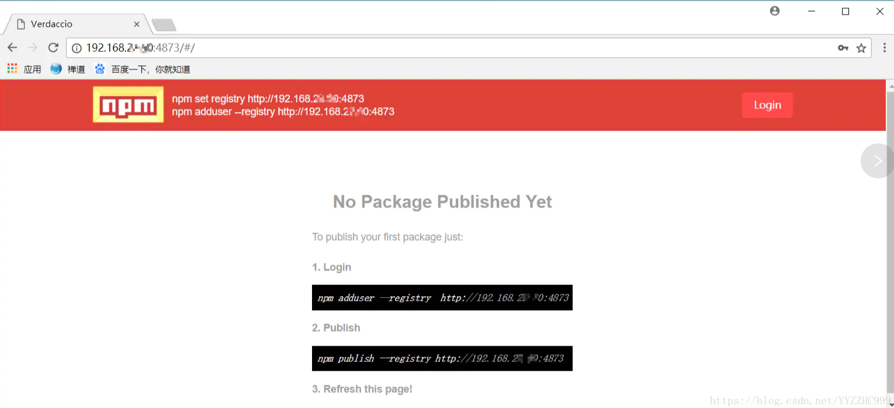

# 使用verdaccio 搭建私有npm 服务器
# 一、搭建

## 1、准备一台服务器

## 2、为什么要搭建npm 服务器
```bash
公司内部开发的私有包和组件库,为了方便统一管理和大家开发和使用（npm install  xxx），但是又不想让外部人员看到，当然也可以使用npm 的付费服务,
自己搭建npm 服务器本身可以自带常用package的缓存, cnpm 有一些包存在路径问题,而npm 的速度有些感人,自建的服务器会缓存下载过的包,能节省时间
```

## 3、安装

```bash
1、连接阿里云服务器（我的服务器里边已经安装了node 配置了防火墙和nginx,npm等）

2、进入如武器后安装verdaccio  
   yg@iZ2zec61wsgbo9t9i346jbZ:~$ npm i -g verdaccio

3、安装完成 输入verdaccio,出现下面信息代表安装成功，同时输入verdaccio后verdaccio已经处于运行状态，当然这种启动时暂时的，我们需要通过pm2让verdaccio服务常驻

   yg@iZ2zec61wsgbo9t9i346jbZ:~$ verdaccio
   warn --- config file  - /home/yg/.config/verdaccio/config.yaml
   warn --- Plugin successfully loaded: htpasswd
   warn --- Plugin successfully loaded: audit
   warn --- http address - http://localhost:4873/ - verdaccio/3.10.1
4、如果找不到verdaccio命令，需要手动将verdaccio配置到环境变量
```
## 4、配置config.yaml

```bash
1、vim /home/yg/.config/verdaccio/config.yaml 进入编辑配置文件

# This is the default config file. It allows all users to do anything,
# so don't use it on production systems.
#
# Look here for more config file examples:
# https://github.com/verdaccio/verdaccio/tree/master/conf
#

# path to a directory with all packages
# 所有包缓存的目录
storage: ./storage
# path to a directory with plugins to include
# 插件目录
plugins: ./plugins

# 开启web服务，能够通过web访问
web:
  # WebUI is enabled as default, if you want disable it, just uncomment this line
  #enable: false
  title: Verdaccio

# 验证信息
auth:
  htpasswd:
    # 用户信息存储目录
    file: ./htpasswd
    # Maximum amount of users allowed to register, defaults to "+inf".
    # You can set this to -1 to disable registration.
    #max_users: 1000

# a list of other known repositories we can talk to
# 公有仓库配置
uplinks:
  npmjs:
    url: https://registry.npmjs.org/

packages:
  '@*/*':
    # scoped packages
    access: $all
    publish: $authenticated
    # 代理，表示没有的仓库去这个npmjs里边去找
    # npmjs 又指向 https://registry.npmjs.org/ ,就是上面的 uplinks 配置
    proxy: npmjs

  '**':
    # allow all users (including non-authenticated users) to read and
    # publish all packages
    #
    # you can specify usernames/groupnames (depending on your auth plugin)
    # and three keywords: "$all", "$anonymous", "$authenticated"
    # 三种身份所有人，匿名用户，认证（登录用户）
    # 是否可访问所需的权限
    access: $all

    # allow all known users to publish packages
    # (anyone can register by default, remember?)
    # 发布package的权限
    publish: $authenticated

    # if package is not available locally, proxy requests to 'npmjs' registry
    # 如果package不存在，就向代理的上游服务器发起请求
    proxy: npmjs

# To use `npm audit` uncomment the following section
middlewares:
  audit:
    enabled: true

# 监听端口，重点，不配置这个只能本机可以访问
listen: 0.0.0.0:4873

# log settings
logs:
  - {type: stdout, format: pretty, level: http}
  #- {type: file, path: verdaccio.log, level: info}
```

## 5、启动
```bash
pm2 start verdaccio (如图1.jpg)   这是后就可以通过http://xxx（ip地址）去访问了

```


## 6、如何使用

```bash
#当前npm 服务指向本地 
npm set registry http://localhost:4873
# 注册用户 在本地注册一个用户然后指向我们的地址然后我们就可以发布包了
npm adduser --registry http://xxx:4873
Username: xxx
Password: xxx
Password:  xxx
Email: (this IS public) xxx
Logged in as yg-ui on http://xxx/ （你的ip地址）
这时候我们就注册一个用户，我们可以用这个用户名和密码去登录去上图窗口去登录了
```

# 二、发布包

## 1、与私服连接
```bash
npm set registry http://xxx：4873 (失败试试：npm config set registry http://xxx:4873 ，然后查看是否配置成功npm config edit）
把下载镜像源的地址切换到从我们的服务器上下载。这里的npmrc文件里面内地址也就会易主
```

## 2、安装nrm
```bash
nrm是 npm registry 管理工具, 能够查看和切换当前使用的registry。不安装也可以，安装会更高效。
1、安装 npm install -g nrm
2、添加私服地址到nrm管理工具

3、这里的 yg-ui是我们给自己的私服地址起的别名，为了切换和使用方便。
   nrm add yg-ui http://xxx:4873 成功后如下
     add registry my50 success
4、将npm包的下载地址改到my50的私服。
   nrm use yg-ui 成功后如下
     verb config Skipping project config: /home/yg/.npmrc.
     Registry has been set to: http://xxx:4873/
5、使用nrm ls可查到我们可以使用的所有镜像源地址，* 后面是当前使用的，如果我们不想从私服上下载包，就可以用上一步骤的nrm use命令，use其它的地址，将下载地址改到别的服务器。
   
   输入 nrm ls 成功后如下
   npm ---- https://registry.npmjs.org/
   cnpm --- http://r.cnpmjs.org/
   taobao - https://registry.npm.taobao.org/
   nj ----- https://registry.nodejitsu.com/
   rednpm - http://registry.mirror.cqupt.edu.cn/
   npmMirror  https://skimdb.npmjs.com/registry/
   edunpm - http://registry.enpmjs.org/ 
   * yg-ui --- http://xxx:4873/

   其实nrm只是个npm registry 管理工具，有了它可以让我们切换和查看registry 地址更方便快捷，即便没有它，我们直接用npm的set命令也可以切换地址，用type命令也可以查看地址，只不过用nrm更便捷，用不用随你了，觉得方便就用。
```

## 3、发布包
```bash
1、新建一个npmtest 目录，里边放一个文件
2、进入目录 npm init 生成package.json
3、npm publish           # 第二次发包已经切换到我们私服地址的情况下
   npm publish --registry http://xxx:4873   #未切换到我们的私服时，直接加后缀可以发布到私服上。
  第二次发包我们需要npm login 输入用户密码以及邮箱即可（这里需要注意的是
```
## 4、下载包
```bash
  npm install npmtest --save

   这个命令是默认下载当前定位文件夹下package.json文件中需要的所有包，包括其间接依赖的包。第一次下载

   之后的包都会缓存在我们的私服上，然后后期下载的时候从私服下载，就不会再从npmjs上下载包，但是它下

   载每个包的时候都会再走一遍npmjs去检查包的版本，即便不下载资源，但这无疑也浪费了时间。经验证发

   现，我们的package-lock.json文件在此刻起了大作用，因为package-lock.json文件本来就是更新node库后自

   动生成的文件，里面包含了node库中所有包的下载地址当前版本以及包之间的依赖关系，既然package-

   lock.json稳定了版本，所以当我们项目中包含了这个文件时，我们下包时就会根据package-lock.json的稳定版

   本来，就不会再去npmjs上去检查了，这样会极大的提升下载包的速度。所以项目中一定要有稳定的

   package.json和package-lock.json文件，并及时更新这两个文件。
   package.json里边配置
   "publishConfig": {
     "registry": "http://xxx/repository/npmself/"
   },
```
## 5、删除包
```bash
yg@iZ2zec61wsgbo9t9i346jbZ:~$ cd /home/yg/.config/verdaccio
yg@iZ2zec61wsgbo9t9i346jbZ:~/.config/verdaccio$ ls
config.yaml  htpasswd  storage
yg@iZ2zec61wsgbo9t9i346jbZ:~/.config/verdaccio$ cd storage
yg@iZ2zec61wsgbo9t9i346jbZ:~/.config/verdaccio/storage$ ls
yg@iZ2zec61wsgbo9t9i346jbZ:~/.config/verdaccio/storage$ rm -rf  ui-test
```
## 6、npm 发布注意点
|参数   |  属性解释   | 注意事项    |
|------------------   |------------------ |----------------|
| name | 包名         |     不可于npm仓库已有包重名|
| version | 版本      |  每次发布都要变更，不可于已发布的包重复|
| author | 作者       |  ---|
| private | 包权限    |  须设置为false|
| mian | 包入口       |  也就是引用包的主入口|
| license | 授权      |  ---|
| description | 描述  |  ---|


项目根目录下须新增`.npmignore` 文件，添加发布npm时要忽略的文件，其实就是只发布package这个包

